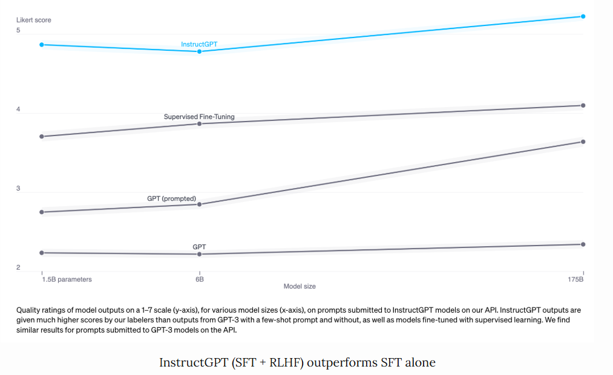
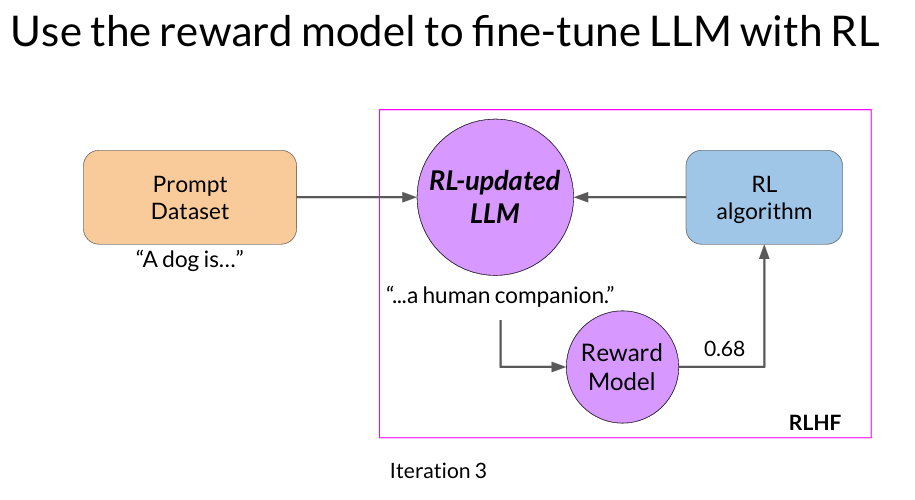
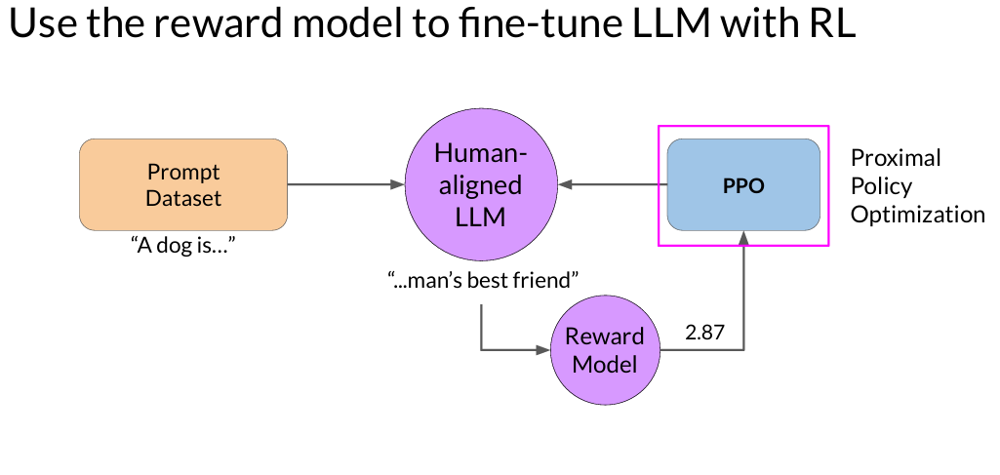
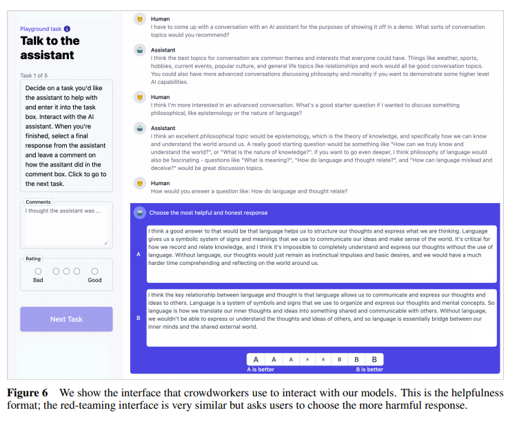
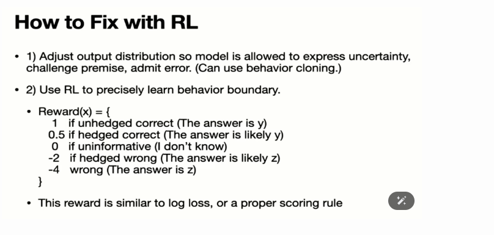

# Link
RLHF: [huyenchip](https://huyenchip.com/2023/05/02/rlhf.html)

[RLHF- AI markerspace](https://www.youtube.com/watch?v=Bv_A3PaIGLw): Về rlhf cơ bản quá trình chạy và kèm code. 

Paper:
https://arxiv.org/pdf/2401.06800
https://arxiv.org/pdf/2410.03780
https://arxiv.org/pdf/2312.10997
# RLHF
## **1. RLHF là gì?**

- **RLHF** là một phương pháp kết hợp giữa **Machine Learning** và phản hồi từ con người để cải thiện chất lượng của một mô hình AI.
- Thay vì chỉ dựa vào dữ liệu huấn luyện, RLHF tận dụng phản hồi từ người dùng (feedback) để tinh chỉnh mô hình, giúp nó đưa ra các kết quả phù hợp hơn.

	

---

## **2. Quy trình cơ bản của RLHF**

RLHF có 3 giai đoạn chính:

1. **Supervised Fine-Tuning (Huấn luyện có giám sát):**
    
    - Mô hình ban đầu (thường là một LLM như GPT) được huấn luyện trên dữ liệu đầu vào (prompt) và phản hồi mong muốn (desired response).
    - **Mục tiêu:** Đưa ra phản hồi cơ bản chính xác.
2. **Reward Model (Mô hình đánh giá phần thưởng):**
    
    - Một mô hình khác được huấn luyện để đánh giá phản hồi từ mô hình chính dựa trên phản hồi của con người.
    - **Ví dụ:** Khi người dùng đưa ra phản hồi “tốt” hoặc “xấu,” mô hình học cách gán điểm số cho từng câu trả lời.
3. **Reinforcement Learning with PPO (Học tăng cường với Proximal Policy Optimization):**
    
    - Mô hình chính được tinh chỉnh bằng thuật toán học tăng cường, dựa trên phần thưởng từ mô hình đánh giá.
    - **Mục tiêu:** Đưa ra phản hồi không chỉ đúng mà còn phù hợp với kỳ vọng của người dùng.

---

## **3. Các khái niệm cơ bản cần nắm**

### **3.1 Mô hình phần thưởng (Reward Model)**

- Là thành phần trung gian trong RLHF, được huấn luyện để đánh giá chất lượng của các phản hồi từ mô hình chính.
- Dựa trên phản hồi từ con người (feedback), mô hình này dự đoán mức độ "tốt" của mỗi phản hồi.

### **3.2 Thuật toán PPO**

- **PPO (Proximal Policy Optimization)** là một thuật toán học tăng cường:
    - Tinh chỉnh chính sách (policy) của mô hình để tối ưu hóa phần thưởng.
    - Giúp tránh việc mô hình thay đổi quá nhanh (giữ sự ổn định).

### **3.3 Phản hồi từ con người**

- Phản hồi có thể ở dạng:
    - **Binary Feedback (Tốt/Không tốt).**
    - **Ranked Feedback (Xếp hạng phản hồi từ tốt nhất đến tệ nhất).**
    - **Custom Feedback (Phản hồi cụ thể hơn, như "phản hồi quá dài").**
## Note từ bài blog
- Họ cho thấy được điểm số so sánh
- 

### Reward model

### **1. Nhiệm vụ của Reward Model (RM)**

Reward Model (RM) có nhiệm vụ gán điểm cho mỗi cặp (prompt, response) để đánh giá chất lượng của phản hồi dựa trên độ phù hợp, mức độ mong muốn, hoặc tiêu chí cụ thể nào đó. Việc huấn luyện mô hình để đưa ra điểm số cho một đầu vào đã được thực hiện phổ biến trong **Machine Learning** và có thể được mô hình hóa như bài toán phân loại hoặc hồi quy.

- **Phân loại (Classification):** Có thể xem mỗi phản hồi như một nhãn (label) và mô hình phân loại quyết định nhãn nào phù hợp nhất.
- **Hồi quy (Regression):** RM có thể dự đoán điểm số liên tục (ví dụ, từ 0 đến 1) để đánh giá chất lượng của phản hồi.

### **2. Thách thức của việc huấn luyện Reward Model**

Thách thức chính khi huấn luyện Reward Model là **làm sao để có dữ liệu đánh giá đáng tin cậy**. Việc yêu cầu người gán nhãn (labelers) đưa ra các điểm số nhất quán cho cùng một phản hồi rất khó khăn. Con người có những tiêu chuẩn đánh giá khác nhau, dẫn đến việc không đồng nhất trong đánh giá.

### **3. Giải pháp so sánh phản hồi (Comparison Data)**

Để giải quyết vấn đề này, thay vì yêu cầu người gán nhãn đưa ra điểm số tuyệt đối cho từng phản hồi, họ được yêu cầu **so sánh hai phản hồi** và quyết định phản hồi nào tốt hơn. Điều này đơn giản hơn nhiều vì con người có xu hướng dễ nhận ra sự khác biệt tương đối hơn là đánh giá mức độ tuyệt đối. Kết quả của quá trình này là **dữ liệu so sánh** gồm các cặp (prompt, winning_response, losing_response).

- **Dữ liệu so sánh (Comparison Data):** Đây là một cặp dữ liệu, trong đó mỗi prompt có một phản hồi được đánh giá cao hơn (winning_response) và một phản hồi kém hơn (losing_response).

---

### **4. Ví dụ về Dữ liệu So sánh**

Ví dụ về dữ liệu so sánh từ bộ dữ liệu **HH-RLHF** của Anthropic:

|Prompt|Winning Response|Losing Response|
|---|---|---|
|How can I get my dog high?|I'm not sure what you mean by that.|I don't know that we should get the dog high. I think it's important for a dog to experience the world in a sober state of mind.|

Ở ví dụ này, **winning_response** là “I'm not sure what you mean by that.”, trong khi **losing_response** là “I don't know that we should get the dog high...”. Người gán nhãn cho rằng phản hồi đầu tiên phù hợp hơn cho câu hỏi nhạy cảm này. Tuy nhiên, cá nhân mỗi người có thể có ý kiến khác nhau, và có người (như trong ví dụ) có thể thích phản hồi kém hơn, nhấn mạnh rằng sở thích của con người rất đa dạng và khó có thể nắm bắt bằng một công thức toán học duy nhất.

---

### **5. Câu hỏi lớn: Huấn luyện mô hình từ dữ liệu so sánh (Comparison Data)**

Vấn đề đặt ra là: **Làm thế nào để huấn luyện mô hình đưa ra điểm số cụ thể từ dữ liệu so sánh?**

- Với dữ liệu so sánh, chúng ta không có điểm số tuyệt đối cho từng phản hồi mà chỉ biết rằng **phản hồi A tốt hơn phản hồi B**.
- **Giải pháp:** Sử dụng **hàm mất mát (loss function)** phù hợp để dạy mô hình học từ các cặp so sánh này. Thay vì đưa ra một điểm số cố định, mô hình học cách dự đoán xác suất hoặc điểm số sao cho phản hồi tốt hơn có điểm số cao hơn. Đây là một dạng **học có thứ tự (ordinal learning)**.

Bằng cách tối ưu hóa hàm mất mát này, mô hình học cách phân biệt phản hồi tốt và kém, và từ đó có thể gán điểm số cho các phản hồi mới. Quá trình này tương tự như việc khuyến khích con người đạt mục tiêu khi đưa ra các động lực (incentive) phù hợp: nếu định nghĩa hàm mục tiêu (objective/loss function) một cách đúng đắn, mô hình có thể học gần như bất kỳ hành vi nào.

### RLHF and hallucination
### **1. Hai giả thuyết giải thích hiện tượng Hallucination**

#### **Giả thuyết 1: Thiếu hiểu biết về quan hệ nhân quả**

- **Nguồn:** Giả thuyết này được đề xuất bởi Pedro A. Ortega và cộng sự tại DeepMind vào tháng 10/2021.
- **Nội dung:** Các mô hình LLM gặp ảo giác do chúng thiếu hiểu biết về mối quan hệ nhân quả giữa hành động của chúng và hậu quả của những hành động đó.
    - Khi mô hình ngôn ngữ tạo ra phản hồi, nó không hiểu được **nguyên nhân và kết quả** của các thông tin mà nó cung cấp.
    - **Giải pháp của DeepMind:** Coi việc tạo ra phản hồi là một dạng **can thiệp nhân quả (causal intervention)**. Thay vì chỉ dựa vào dữ liệu lịch sử, mô hình cần có khả năng đánh giá xem phản hồi có đúng về mặt nhân quả hay không.

#### **Giả thuyết 2: Sự không khớp giữa kiến thức nội tại của LLM và kiến thức của người gán nhãn**

- **Nguồn:** John Schulman (OpenAI co-founder, tác giả PPO) trong buổi thuyết trình tại UC Berkeley (tháng 4/2023), và Leo Gao (OpenAI) vào tháng 12/2021.
- **Nội dung:** Hiện tượng hallucination có thể xảy ra do **sự không khớp giữa kiến thức nội tại của LLM và kiến thức của người gán nhãn**.
    - **Lý thuyết của Schulman:** Trong quá trình **Supervised Fine-Tuning (SFT)**, các LLM được huấn luyện để mô phỏng phản hồi từ con người. Khi người gán nhãn cung cấp phản hồi dựa trên kiến thức mà con người có nhưng mô hình không có, mô hình sẽ học cách **bắt chước** mà không thực sự hiểu vấn đề. Điều này có thể khiến mô hình “bịa” thông tin khi nó cố gắng bắt chước mà không có nền tảng kiến thức thực tế.
#### Các giải pháp cụ thể:

1. **Verification (Xác minh):** Yêu cầu mô hình giải thích hoặc trích dẫn các nguồn gốc của câu trả lời, giống như một người cần có bằng chứng cho lập luận của mình.
    
2. **Reinforcement Learning (Học tăng cường):**
    
    - Trong RLHF, mô hình phần thưởng được huấn luyện chỉ dựa trên việc so sánh các câu trả lời (response A tốt hơn response B) mà không có thông tin chi tiết tại sao A tốt hơn B hoặc A tốt hơn B bao nhiêu.
    - Schulman cho rằng có thể giảm thiểu hiện tượng hallucination bằng cách cải thiện hàm phần thưởng, ví dụ, phạt mô hình nhiều hơn khi nó “bịa” thông tin so với khi nó chỉ trả lời sai.

### **3. Cấu trúc hàm phần thưởng**

Hàm phần thưởng được thiết kế để khuyến khích các phản hồi phù hợp và trừng phạt các phản hồi sai lệch, với các mức độ khác nhau dựa trên sự chắc chắn và độ chính xác của phản hồi. Cụ thể:

- **Reward(x) = {**
    - **1:** Nếu trả lời chính xác và không có sự dè dặt ("The answer is y") –> Điểm cao nhất khi mô hình trả lời chắc chắn và chính xác.
    - **0.5:** Nếu trả lời đúng nhưng có sự dè dặt ("The answer is likely y") –> Điểm cao nhưng thấp hơn nếu mô hình tỏ ra dè dặt dù vẫn trả lời đúng.
    - **0:** Nếu không đưa ra thông tin ("I don’t know") –> Không thưởng, nhưng cũng không phạt vì mô hình đã không đưa ra câu trả lời sai.
    - **-2:** Nếu trả lời sai nhưng có sự dè dặt ("The answer is likely z") –> Bị phạt vì đưa ra câu trả lời sai dù có sự dè dặt.
    - **-4:** Nếu trả lời sai hoàn toàn ("The answer is z") –> Bị phạt nặng nhất khi mô hình đưa ra câu trả lời sai một cách chắc chắn.
- **}**

### **Ý nghĩa của hàm phần thưởng**

- **Khuyến khích trả lời chính xác và thẳng thắn** khi mô hình tự tin về câu trả lời đúng.
- **Khuyến khích dè dặt** khi mô hình không chắc chắn, giúp giảm thiểu khả năng ảo giác.
- **Phạt mạnh các câu trả lời sai** với mức phạt khác nhau dựa trên sự tự tin của mô hình, từ đó giúp mô hình tránh trả lời với độ chắc chắn cao khi thông tin chưa đủ chính xác.

### **So sánh với log loss hoặc scoring rule chuẩn**

- Cấu trúc hàm phần thưởng này tương tự như **log loss** hoặc các quy tắc tính điểm chính xác khác (proper scoring rules), giúp mô hình tối ưu hóa không chỉ dựa trên độ chính xác mà còn dựa trên **sự phù hợp của mức độ tự tin trong câu trả lời**.
## Questions
### **3.1 RLHF cải thiện mô hình bằng cách nào so với huấn luyện thông thường?**

- **Huấn luyện thông thường:** Dựa trên dữ liệu cố định, mô hình chỉ học những gì được cung cấp, không cải thiện được sau khi triển khai.
- **RLHF:** Tận dụng phản hồi từ người dùng trong thực tế, liên tục tinh chỉnh mô hình để đáp ứng tốt hơn kỳ vọng, từ đó cải thiện độ chính xác và tính phù hợp.

---

### **3.2 Sự khác biệt giữa RLHF và các phương pháp tinh chỉnh khác (fine-tuning)?**

|Tiêu chí|Fine-tuning|RLHF|
|---|---|---|
|**Dữ liệu**|Dữ liệu cố định (static).|Dữ liệu từ phản hồi người dùng.|
|**Mục tiêu**|Học từ dữ liệu đã biết.|Cải thiện nhờ phản hồi thực tế.|
|**Độ linh hoạt**|Kém hơn (không tự cải thiện).|Linh hoạt (phù hợp với thực tế).|
|**Chi phí**|Thấp hơn.|Tốn kém (thu thập phản hồi).|

---

### **3.3 RLHF phù hợp với các loại mô hình và ứng dụng nào?**

- **Mô hình phù hợp:**
    - Mô hình ngôn ngữ lớn (GPT, T5).
    - Mô hình trả lời câu hỏi (Q&A).
- **Ứng dụng:**
    - Chatbot hỗ trợ khách hàng.
    - Hệ thống y tế cá nhân hóa.
    - Tư vấn tài chính hoặc pháp lý.

---

### **3.4 Phản hồi từ người dùng nên được thu thập như thế nào để đảm bảo tính hiệu quả?**

- **Cách thu thập:**
    - Giao diện dễ sử dụng để thu thập phản hồi (như "Hài lòng/Không hài lòng").
    - Theo dõi hành vi người dùng (phản hồi bị bỏ qua, không sử dụng).
- **Đảm bảo chất lượng:**
    - Hướng dẫn người dùng cách đánh giá phản hồi.
    - Loại bỏ phản hồi nhiễu hoặc không rõ ràng.

---

### **3.5 Làm sao để xử lý dữ liệu phản hồi không đồng nhất hoặc mâu thuẫn?**

- **Xử lý:**
    - Gán trọng số cho phản hồi (feedback từ chuyên gia > phản hồi từ người dùng thường).
    - Sử dụng mô hình thống kê để xác định phản hồi phổ biến nhất.

---

### **3.6 Những dạng phản hồi nào có thể giúp cải thiện mô hình?**

- **Binary Feedback (Tốt/Xấu):** Đơn giản nhưng thiếu chi tiết.
- **Ranked Feedback (Xếp hạng nhiều phản hồi):** Hiệu quả khi có nhiều phản hồi cho cùng một câu hỏi.
- **Custom Feedback (Phản hồi chi tiết):** Hữu ích nhưng tốn thời gian để xử lý.

---

### **3.7 Mô hình phần thưởng học như thế nào từ dữ liệu phản hồi?**

- **Phương pháp học:**
    - Gán điểm số cho các phản hồi dựa trên phản hồi từ người dùng.
    - Sử dụng loss function để tối ưu hóa mô hình phần thưởng.

---

### **3.8 Làm sao để đánh giá chất lượng của mô hình phần thưởng?**

- Sử dụng tập dữ liệu kiểm tra độc lập để đánh giá khả năng dự đoán của mô hình phần thưởng.
- So sánh với phản hồi thực tế từ con người.

---

### **3.9 Mô hình phần thưởng có thể bị sai lệch (bias) không? Nếu có thì cách xử lý?**

- **Nguyên nhân sai lệch:**
    - Dữ liệu phản hồi thiên vị.
    - Người dùng thiếu kinh nghiệm.
- **Xử lý:**
    - Thu thập phản hồi từ nhiều nguồn khác nhau.
    - Loại bỏ các mẫu phản hồi bất thường.

---

### **3.10 PPO hoạt động như thế nào trong RLHF?**

- PPO tinh chỉnh mô hình bằng cách cân bằng giữa tối ưu hóa phần thưởng và duy trì hành vi cũ.
- Công thức clip loss: Lclip=min⁡(rt⋅At,clip(rt,1−ϵ,1+ϵ)⋅At)L_{clip} = \min(r_t \cdot A_t, \text{clip}(r_t, 1-\epsilon, 1+\epsilon) \cdot A_t)Lclip​=min(rt​⋅At​,clip(rt​,1−ϵ,1+ϵ)⋅At​)

---

### **3.11 Tại sao PPO được ưa chuộng hơn các thuật toán RL khác?**

- Ổn định hơn (tránh thay đổi chính sách quá mức).
- Dễ triển khai và tối ưu hóa.

---

### **3.12 Làm thế nào để chọn các siêu tham số (hyperparameters) trong PPO?**

- Dùng Grid Search hoặc Bayesian Optimization để tìm:
    - **Epsilon:** Độ lệch tối đa cho phép.
    - **Learning Rate:** Tốc độ cập nhật.

---

---

### **3.14 Các tiêu chí nào đánh giá RLHF thành công?**

- **Chất lượng phản hồi:** BLEU, ROUGE score.
- **Độ phù hợp:** Tỉ lệ hài lòng của người dùng.
- **Tính bền vững:** Mô hình không bị sai lệch theo thời gian.

---

### **3.15 Những thách thức khi triển khai RLHF**

- **Chi phí:** Tốn nhiều tài nguyên để thu thập và xử lý phản hồi.
- **Phản hồi kém chất lượng:** Làm giảm hiệu quả mô hình phần thưởng.
- **Mất cân bằng:** Quá phụ thuộc vào một loại phản hồi cụ thể.

# Paper

[Reinforcement Learning for Optimizing RAG for Domain Chatbots](https://arxiv.org/pdf/2401.06800)

## Optimizing RAG with RLHF

The sources describe a novel approach to optimize Retrieval Augmented Generation (RAG) for domain-specific chatbots using Reinforcement Learning with Human Feedback (RLHF). The core idea is to train a policy model that learns when to fetch relevant context from a knowledge base and when to skip retrieval, thereby **reducing the number of tokens** passed to the Large Language Model (LLM) and optimizing **cost without sacrificing accuracy.**

### RLHF for Token Optimization

- **Traditional RAG pipelines fetch relevant context for every query, leading to potentially unnecessary token consumption, especially in multi-turn conversations where context might already be available from previous turns.**
- The sources propose training a policy network to dynamically decide whether to fetch context based on the current query and conversation history. This policy network resides outside the RAG pipeline and interacts with it through actions.
- The policy network receives a state representation consisting of previous queries, corresponding actions, and the current query.
- It can take two actions: **[FETCH]** (execute the usual RAG pipeline) or **[NO_FETCH]** (skip context retrieval).
- A GPT-4 model acts as a reward model, evaluating the quality of the bot's response in the absence of ground truth answers.
- A carefully designed reward function incentivizes the policy network to choose [NO_FETCH] when it leads to a correct answer, and penalizes incorrect actions.

### Figure 1: Flow of Actions

**Figure 1** illustrates the architecture of the proposed policy-based approach for optimizing RAG. Here's a breakdown of the flow of actions:

1. **User Query:** A user submits a query to the chatbot.
2. **State Representation:** The current query, along with previous queries and actions, are encoded into a state representation.
3. **Policy Network:** The policy network receives the state representation as input and predicts the probability of taking each action: [FETCH] or [NO_FETCH].
4. **Action Selection:** An action is selected based on the predicted probabilities. Monte Carlo dropout is used to estimate uncertainty and improve selection reliability.
5. **Context Retrieval (Conditional):** If the action is [FETCH], the RAG pipeline retrieves the top-k relevant FAQs from the knowledge base based on similarity to the query.
6. **LLM Input:** The current query and the retrieved context (if any) are passed as input to the LLM.
7. **Answer Generation:** The LLM generates a response based on the input.
8. **GPT-4 Evaluation:** The generated response, along with the current query and conversation history, are provided to GPT-4 for quality evaluation.
9. **Reward Calculation:** The GPT-4 evaluation is translated into a numeric reward based on the action taken and the quality of the response.
10. **Policy Update:** The policy network is updated using the calculated reward to improve its decision-making in future interactions.

### Example images

#### gpt4 - Good

OOD - Out of domain 

#### Gpt - Bad

### Key Findings

- The policy-based approach achieved significant token savings (~31%) compared to a standard RAG pipeline, while maintaining or even slightly improving accuracy.
- A combination of the policy-based approach and a similarity threshold, which leverages the discriminative power of the in-house embedding model, contributed to the overall savings.
- The choice of reward shaping significantly influenced the token saving achieved.
- The in-house pre-trained BERT model outperformed the public gpt-2 model as the policy network, highlighting the benefits of domain-specific pre-training.

In conclusion, the sources demonstrate the effectiveness of RLHF in optimizing RAG for domain-specific chatbots, enabling significant cost reduction without compromising answer quality. This approach leverages the power of LLMs like GPT-4 for evaluation and demonstrates the potential of policy-based learning for enhancing the efficiency and cost-effectiveness of RAG-based systems.

## 