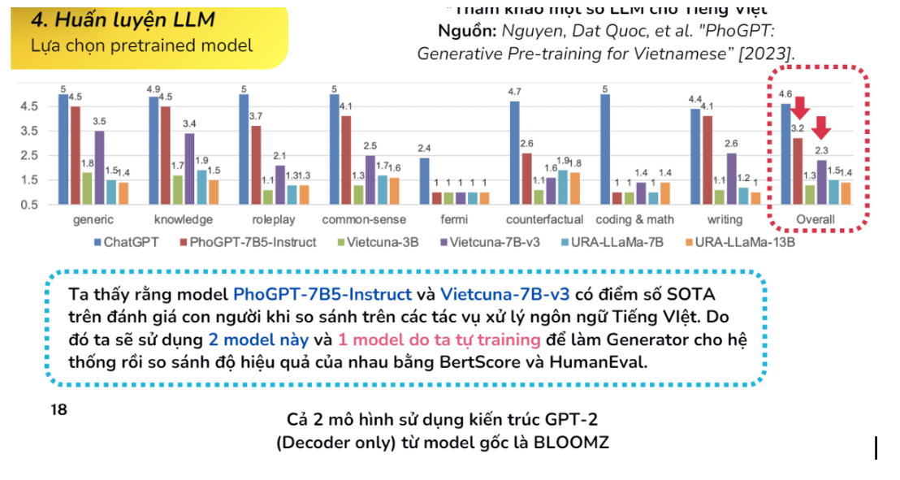
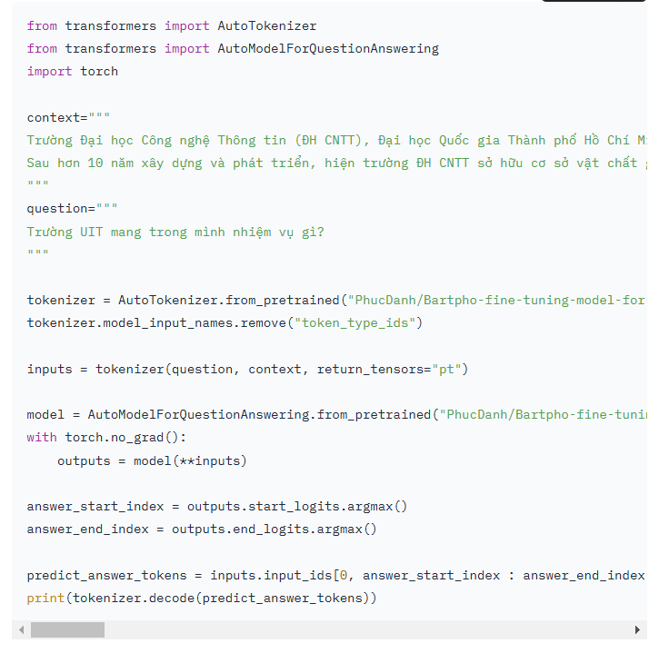

# Bartpho-fine-tuning-model
[Bartpho-fine-tuning-model](https://huggingface.co/PhucDanh/Bartpho-fine-tuning-model-for-question-answering)

Cái này hơi vượt mức vì nó nặng tới 369M paramesters lận nên khó

# Vit5-base
[vit5-base](https://huggingface.co/VietAI/vit5-base)

Trên đây có nhiều mô hình đã finetune tại sao mình không finetune để cho dữ liệu data hợp lý để hiểu trường mình. 
#### Note:
- Đã thực nghiệm với mô hình

# PhoGPT-4B-Chat
[PhoGPT-4B-Chat](https://huggingface.co/vinai/PhoGPT-4B-Chat)

Còn 1 phiên bản là 7b5 nữa 
[PhoGPT-4B-Chat](https://huggingface.co/vinai/PhoGPT-7B5)

# vinallama-7b-chat
[vinallama-7b-chat](https://huggingface.co/vilm/vinallama-7b-chat)

mô hình này 6.86M para.  text_generations. 

[vlim](https://huggingface.co/vilm)
- Trong linh này còn nhiều mô hình khác nữa để thực nghiệm. Ví dụ như vietcuna...

# Embedding tiếng việt

[Link bài viết anh Bá ngọc] (https://www.facebook.com/photo/?fbid=7826759007379869&set=gm.500908625841511&idorvanity=240232641909112)

[Colab](https://colab.research.google.com/drive/15MiLoNLUslKnOhE6BpluHqSaFXhksJTm?usp=sharing#scrollTo=C-xQh0ZrsIYW)

[Thang Nguyen Chien](https://www.facebook.com/thangnch?__cft__[0]=AZUAKRzdaypO8HvFHT14bh9AfIwy3kmxzhnllyFdf1eClETN46RliHaBaNuC6D0eM_tsuYNxrtwagY_JhgqNbeFvXa0axw9s-Zz5WtgLIJnzyGALrbu_k5IyVJNm1hM7JhisYvAet9Uhh_xdP8DWA0cqmJET9JbfBSM_aJeulEqAG7dahLuX2UGWC5iq_TWxhXc_xCvJBrqSrhd9D7SaBWQV&__tn__=R*F) Theo ảnh thì là cái VoVanPhuc/sup-SimCSE-VietNamese-phobert-base còn em hay dùng cái **keepitreal/vietnamese-sbert**

https://huggingface.co/keepitreal/vietnamese-sbert

https://huggingface.co/hiieu/halong_embedding